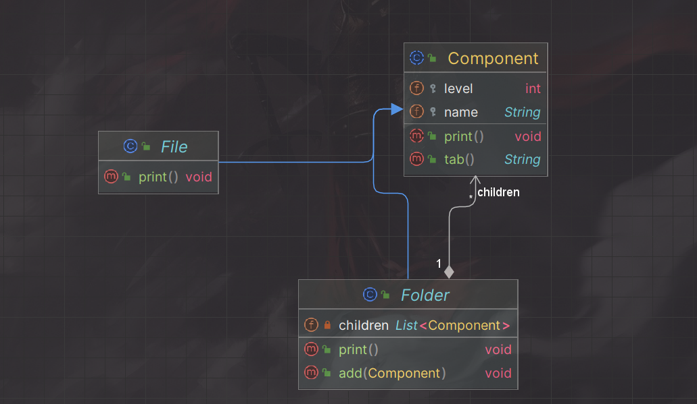
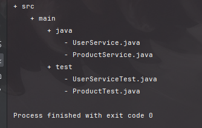

# Composite Pattern;

- **Composite** is a structural design pattern that lets you compose objects into tree structures and then work with these structures as if they were individual objects.
- Using the Composite pattern makes sense only when the core model of your app can be represented as a tree.

    For example imagine  that you have two types of objects: Files and folders.
    A folder can contain several files as well as other sub folders.
    The sub folders can also create files and sub folders and so on.
    
<h4> How to print the names of files and folders as a  hierarchy tree of folders ?? </h4>

<h3> Solution</h3>

The Composite pattern suggest that you work with folders and files though
a common interface which declares a method for printing the name of file/folder

for a file the method will print the name of the file and for a folder it will
print the name and iterate over the sub files and folders within a folder

<h3> Structure</h3>

- The **Component** is an abstract class that describes operations that are common to both simple and complex elements of the tree.
- The **File** is a child of a folder.
- The Folder (Composite) is an element that has sub-elements: files or folders

when we want to print the name of root folder for example we just need to call the print method of the subject folder and then it will delegates the work to its sub-elements

<h3> Result: </h3>
