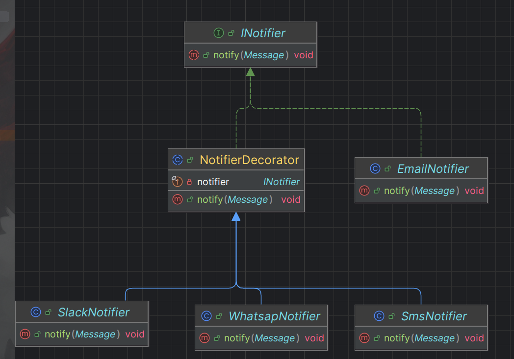

# Decorator Pattern;

- **Decorator** is a structural design pattern that lets you attach new behaviors to objects by placing these objects inside special wrapper objects that contain the behaviors.

      For example you have a basic notifier class that sends notifications by email.
      Over time, you want to extend the types of notifications,
      such as sending notifications via, SMS, Slack, Whatsapp, etc. Rather than modifying the original
      email notifier class whenever a new type of notification is needed
      you can use the Decorator Pattern to wrap additional behaviors around the base notification system.

<h3> Solution</h3>

- **Component (Notifier Interface)**: The basic interface that all types of notifiers will implement.

- **Concrete Component (EmailNotifier)**: the concrete implementation of the notifier which sends notifications only using email.

- **Decorator(NotifierDecorator)**: The abstract class that wraps the basic notifier. It implements the same interface but allows additional functionality to be "decorated" onto the original notifier.

- **Concrete Decorators (SlackNotifier, SMSNotifier, etc.)**: These decorators add specific notification methods (like Slack or SMS) by wrapping around the base notifier.

<h3> Structure</h3>

**Wrapper** is the alternative nickname for the Decorator pattern that clearly expresses the main idea of the pattern. A wrapper is an object that can be linked with some target object. The wrapper contains the same set of methods as the target and delegates to it all requests it receives. However, the wrapper may alter the result by doing something either before or after it passes the request to the target.

When does a simple wrapper become the real decorator? As I mentioned, the wrapper implements the same interface as the wrapped object. That’s why from the client’s perspective these objects are identical. Make the wrapper’s reference field accept any object that follows that interface. This will let you cover an object in multiple wrappers, adding the combined behavior of all the wrappers to it.

<h3> Result: </h3>
and voilaa!! you better run
